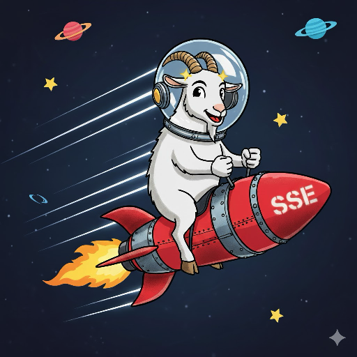

## GoaTeD template
- Golang
- [Datastar](https://data-star.dev/)
- [Templ](https://templ.guide/) templates
- [Templier](https://github.com/romshark/templier) live reload

Live reload is enabled by Templier on http://localhost:7331/.

The underlying Chi server runs on 8080.

## Running
1. Install Go
`brew install go` on Mac or https://go.dev/dl and then verify with:
```sh
go version
```
2. Install the Templier CLI
```sh
go install github.com/romshark/templier@latest
# Ensure the Go bin dir is on PATH (restart shell if needed)
export PATH="$HOME/go/bin:$PATH"
```

3. Download dependencies from go.mod
```sh
go mod download
```
4. Run Templier from the project root (re-run this whenever templates change):
```sh
templier
```

## Scope
This repo will be kept *small* as a jumping-off point / sandbox. For more DataStar examples, see:

- [northstar](https://github.com/zangster300/northstar)
- [todostar](https://github.com/romshark/todostar)
- [datastar-resources](https://github.com/alvarolm/datastar-resources)